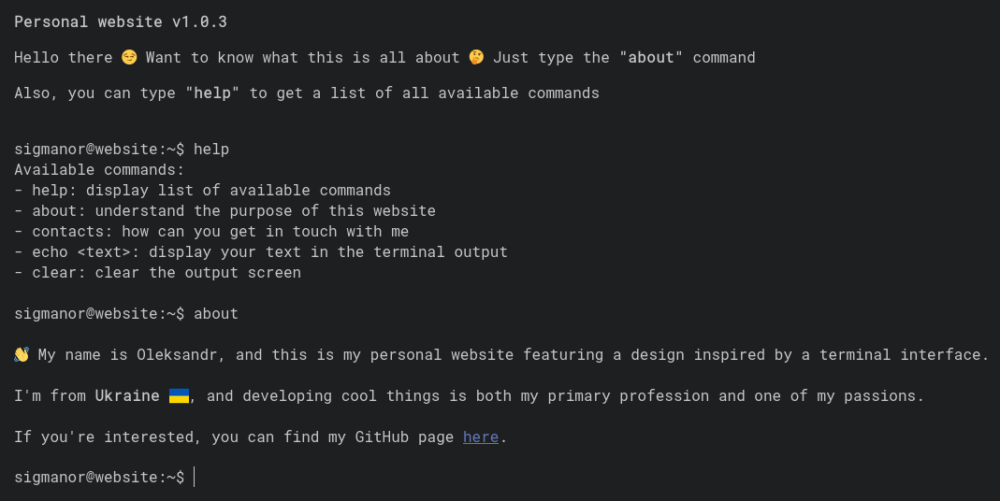

# sigmanor.github.io

A minimalist personal website featuring a terminal-like interface. Visitors can interact with the site using various commands to learn about me and my work.

## Features

- Interactive terminal-style interface
- Command-line navigation system
- Available commands:
  - `help` - Display list of available commands
  - `about` - Learn about the website's purpose
  - `contacts` - View contact information
  - `echo <text>` - Display custom text
  - `clear` - Clear the terminal screen
- Responsive design for mobile devices
- Random version number generation on page load

## Technologies

- HTML5
- CSS3
- JavaScript (Vanilla)
- Google Fonts (Roboto Mono)

## Getting Started

### Prerequisites

- Any modern web browser (Chrome, Firefox, Safari, Edge)
- JavaScript enabled

### Installation

1. Clone the repository:
   ```bash
   git clone https://github.com/Sigmanor/personal-website.git
   ```
2. Open `index.html` in your web browser

## Development

This is a static website that requires no build process. To develop locally:

1. Make changes to the source files:
   - `index.html` - Main HTML structure
   - `css/style.css` - Styling
   - `js/script.js` - Terminal functionality
2. Refresh your browser to see changes
3. Test on different screen sizes using browser dev tools

## Deployment

The website can be deployed to any static hosting service:

1. Upload all files maintaining the directory structure
2. Ensure all assets are properly linked
3. Configure your domain if needed

## Screenshots



## License

This project is licensed under the MIT License - see the [LICENSE](LICENSE) file for details.

## Contact

- Twitter: [@sigmanor](https://x.com/sigmanor)
- LinkedIn: [Oleksandr Panchenko](https://www.linkedin.com/in/oleksandr-panchenko-5a88a721a)
- Email: sigmanor@pm.me
